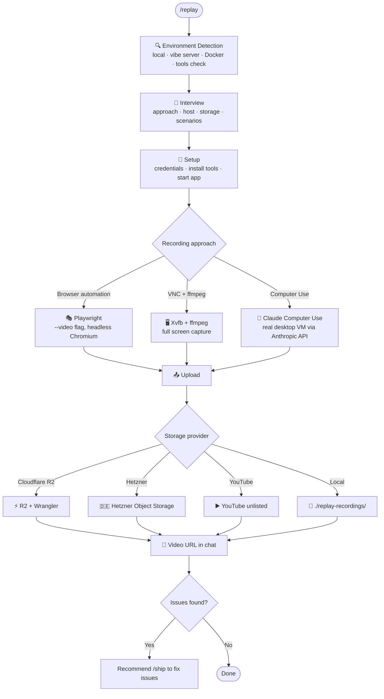

# 🎬 replay.md

Record a live video of your running app — in the cloud or locally — and share it. One interview, one clean pass: environment detected, app launched, session recorded, video uploaded.

Cursor has it. Now Claude Code has it too.

[](https://github.com/amajorai/replay.md)
[](https://github.com/amajorai/replay.md)
[](https://github.com/amajorai/replay.md)
[](https://github.com/amajorai/replay.md)
[](https://github.com/amajorai/replay.md/issues)

> [!NOTE]
> These skills have been built and tested with **Claude Code**. Codex support is untested. If you try them on Codex, we'd love your help. [Open an issue](https://github.com/amajorai/replay.md/issues) to share what works and what doesn't.

## Works great with

- 🪅 **[vibe.md](https://github.com/amajorai/vibe.md)** to provision a 24/7 cloud server — replay auto-detects it and records there without any local setup.
- 📦 **[ship.md](https://github.com/amajorai/ship.md)** to fix issues found during recording. Ship recommends `/replay` at the end of every pipeline run so you can record proof of what shipped.
- 🔎 **[fix.md](https://github.com/amajorai/fix.md)** to dig into bugs spotted during recording — use `/fix` to instrument and confirm root cause before fixing.
- 🎉 **[party.md](https://github.com/amajorai/party.md)** to run replay autonomously on every deploy — drop a record issue into your board and party.md handles the rest.

## Skills

| Skill | What it does |
|-------|-------------|
| [`/replay`](skills/replaymd/SKILL.md) | Detect environment, interview for recording approach + storage provider, launch app, record session, upload video, return URL to chat |

## How it works



## Recording approaches

| Approach | Best for | Requires |
|---|---|---|
| **Browser automation** (Playwright) | Web apps | Nothing extra — Playwright installed automatically |
| **VNC + ffmpeg** | Any app type (web, desktop, TUI, CLI) | Linux with `Xvfb` + `ffmpeg` (auto-installed) |
| **Computer Use API** | Most realistic "Cursor-like" experience | `ANTHROPIC_API_KEY` + Docker |

## Storage providers

| Provider | Cost | Setup |
|---|---|---|
| **Cloudflare R2** | Very cheap, global CDN | `CLOUDFLARE_ACCOUNT_ID` + `R2_BUCKET` + `CLOUDFLARE_API_TOKEN` |
| **Hetzner Object Storage** | Low cost, EU-based | `AWS_ACCESS_KEY_ID` + `AWS_SECRET_ACCESS_KEY` + `HETZNER_ENDPOINT` |
| **YouTube** (unlisted) | Free | `YOUTUBE_CLIENT_ID` + `YOUTUBE_CLIENT_SECRET` |
| **Local file** | Free | Nothing |

## Vibe server integration

If you've run `/vibe`, replay auto-detects your server:

```bash
# replay checks for:
cat ~/.vibe/server 2>/dev/null    # written by /vibe on first setup
echo $VIBE_SERVER                 # or set this env var manually
```

When found, replay uses the vibe server for recording — no local Docker needed, no ephemeral VPS costs, full 24/7 availability.

## Quickstart

```bash
npx skills add amajorai/replay.md
```

Then in Claude Code:

```
/replay
```

or point it at something specific:

```
/replay record the checkout flow on https://myapp.com
```

### Auto-Update

Auto-update is opt-in. Pass `--update` or set `SKILLS_AUTO_UPDATE: true` in your project CLAUDE.md.

### Claude Code plugin

```
/plugin marketplace add amajorai/replay.md
/plugin install replaymd@amajorai
```

Invoke as `/replaymd:replay`.

## Star History

<a href="https://www.star-history.com/#amajorai/replay.md&Date">
 <picture>
   <source media="(prefers-color-scheme: dark)" srcset="https://api.star-history.com/svg?repos=amajorai/replay.md&type=Date&theme=dark" />
   <source media="(prefers-color-scheme: light)" srcset="https://api.star-history.com/svg?repos=amajorai/replay.md&type=Date" />
   
 </picture>
</a>
